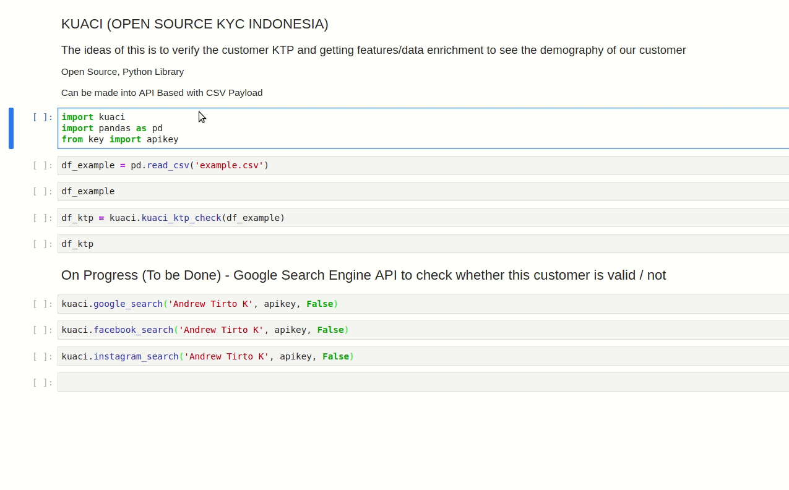

# kuaci
Open Source KTP Checker + KYC

This repository contain the lookup data for mapping the KTP into Location.
This data requires a lot of time to make it.
And the logic is in the `kuaci.py`.

This my first time trying to create an open source :)
Please be kind.